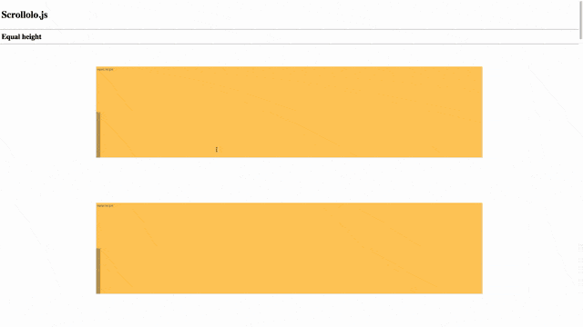

## scrollolo.js
Animates elements when entering viewport.

1. requires Jquery, Animate.css.
2. manually tested on latest version of Chrome, Firefox, Safari, IE.
3. optional custom animations, using data-attributes.


## Demo


Demo link at http://htmlpreview.github.io/?https://github.com/simboonlong/scrollolo.js/blob/master/site/index.html


## Mechanics
- RAF scrolling checks if scrollolo element is within viewport.
- Add animation css class when in viewport.
- Default transition is fading in.


## Usage
To use, assign `scrollolo` class to any element you want to animate.
```

<div class="scrollolo"></div>

```

Include `scrollolo.js` script.
```

<script type="text/javascript" src="js/scrollolo.js"></script>

```

Then initialize `scrollolo.js`.

```

Scrollolo.init();

```

## Customizing
Use data attributes `data-animation` to do customized animation behaviour on any element with the scrollolo class.

Example:
```

<div class="scrollolo" data-animation="bounceInDown">

```

Please refer to [documentation](https://github.com/daneden/animate.css) of animate.css by Daniel Eden.


## License
scrollolo.js is licensed under the MIT license. (http://opensource.org/licenses/MIT)


## Contributing
Feel free to contribute.
